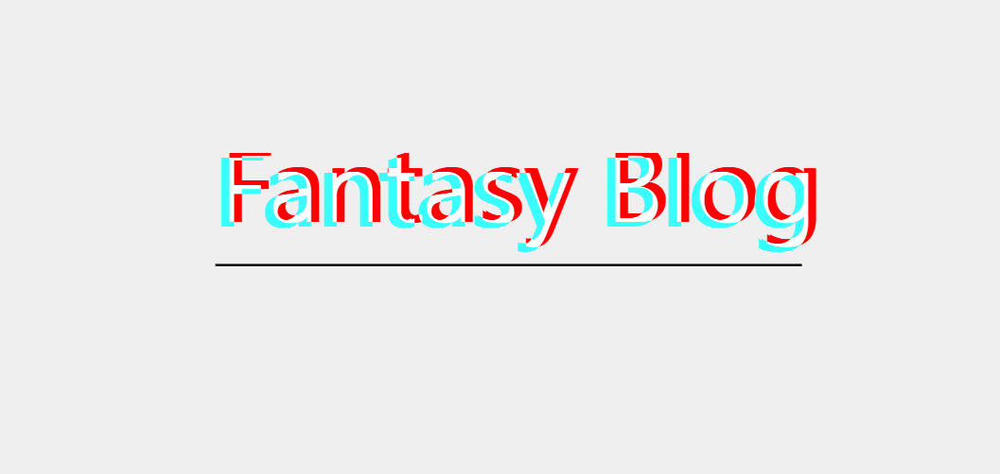

<p align="center">
	<a href="https://naccl.top/" target="_blank">
		
	</a>
</p>
<p align="center">
	
	
	
	
</p>

## 简介

本项目根据开源项目https://github.com/Naccl/NBlog进行改写,主要用于对后端代码进行学习

本着『前后端分离，人不分离』的要领，开发了此基于 Spring Boot + Vue 前后端分离博客系统

## 后端

1. 核心框架：[Spring Boot](https://github.com/spring-projects/spring-boot)
4. 持久层框架：[MybatisPlus](https://baomidou.com/pages/24112f/)
5. 分页插件：[PageHelper](https://github.com/pagehelper/Mybatis-PageHelper)
6. NoSQL缓存：[Redis](https://github.com/redis/redis)(暂未使用)
7. Markdown 转 HTML：[commonmark-java](https://github.com/commonmark/commonmark-java)
8. 离线 IP 地址库：[ip2region](https://github.com/lionsoul2014/ip2region)
9. 定时任务：[quartz](https://github.com/quartz-scheduler/quartz)
10. UserAgent 解析：[yauaa](https://github.com/nielsbasjes/yauaa)

基于 JDK8 开发，8以上要添加依赖：

```xml

<dependency>
    <groupId>javax.xml.bind</groupId>
    <artifactId>jaxb-api</artifactId>
    <version>2.3.0</version>
</dependency>
```

## 前端

核心框架：Vue2.x、Vue Router、Vuex

Vue 项目基于 @vue/cli4.x 构建

JS 依赖及参考的
css：[axios](https://github.com/axios/axios)、[moment](https://github.com/moment/moment)、[nprogress](https://github.com/rstacruz/nprogress)、[v-viewer](https://github.com/fengyuanchen/viewerjs)、[prismjs](https://github.com/PrismJS/prism)、[APlayer](https://github.com/DIYgod/APlayer)、[MetingJS](https://github.com/metowolf/MetingJS)、[lodash](https://github.com/lodash/lodash)、[mavonEditor](https://github.com/hinesboy/mavonEditor)、[echarts](https://github.com/apache/echarts)、[tocbot](https://github.com/tscanlin/tocbot)、[iCSS](https://github.com/chokcoco/iCSS)

备注: 本人并未对此开源项目的前端代码进行修改

### 后台 UI

后台 CMS 部分基于 [vue-admin-template](https://github.com/PanJiaChen/vue-admin-template)
二次修改后的 [my-vue-admin-template](https://github.com/Naccl/my-vue-admin-template)
模板进行开发（于2021年11月1日重构过一次，[重构 commit](https://github.com/Naccl/NBlog/commit/b33641fe34b2bed34e8237bacf67146cd64be4cf)）

UI 框架为 [Element UI](https://github.com/ElemeFE/element)

### 前台 UI

[Semantic UI](https://semantic-ui.com/)：主要使用，页面布局样式，个人感觉挺好看的 UI 框架，比较适合前台界面的开发，语义化的 css，前一版博客系统使用过，可惜该框架 Vue
版的开发完成度不高，见 [Semantic UI Vue](https://semantic-ui-vue.github.io/#/)

[Element UI](https://github.com/ElemeFE/element)：部分使用，一些小组件，弥补了 Semantic UI 的不足，便于快速实现效果

文章排版：基于 [typo.css](https://github.com/sofish/typo.css) 修改

## 快速开始

1. 创建 MySQL 数据库`fantasy-blog`，并执行`/Fantasy-Blog/nblog.sql`初始化表数据
2. 修改配置信息`Fantasy-Blog/src/main/resources/application.yml`
3. 安装 Redis 并启动(暂不需要)
4. 启动后端服务
5. 分别在`blog-cms`和`blog-view`目录下执行`npm install`安装依赖
6. 分别在`blog-cms`和`blog-view`目录下执行`npm run serve`启动前后台页面

## 致谢

感谢 [Naccl](https://github.com/Naccl) 提供的开源项目
